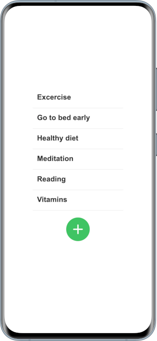
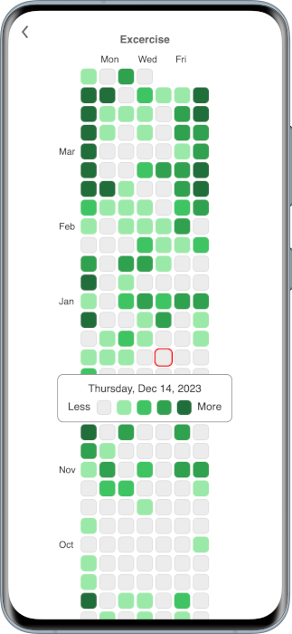

# Huely


Huely is a simple habit tracker app for Android and iOS that allows you to track your progress with a Github-like contributions graph.

&nbsp;&nbsp;&nbsp;&nbsp;

## Features

- Simple, uncluttered interface
- Github contributions style calendar
- Light and dark design, depending on system settings
- Support for multiple languages
- All personal data is stored locally
- The data can also be exported

## Building

The app is built on pure HTML5 + JavaScript and uses [Capacitor](https://capacitorjs.com/) as its native runtime.

Simplified guide for building the Android app:
```bash
npm install
npm run build
npx cap add android
npm run icons
npx can run android
```